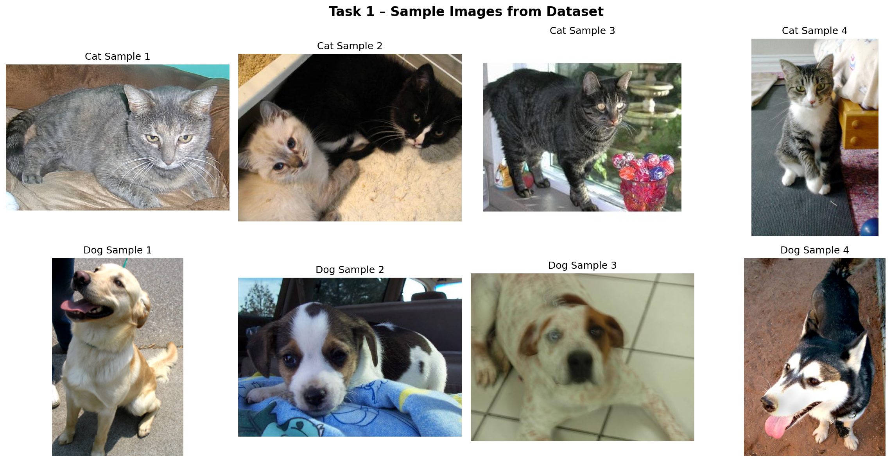
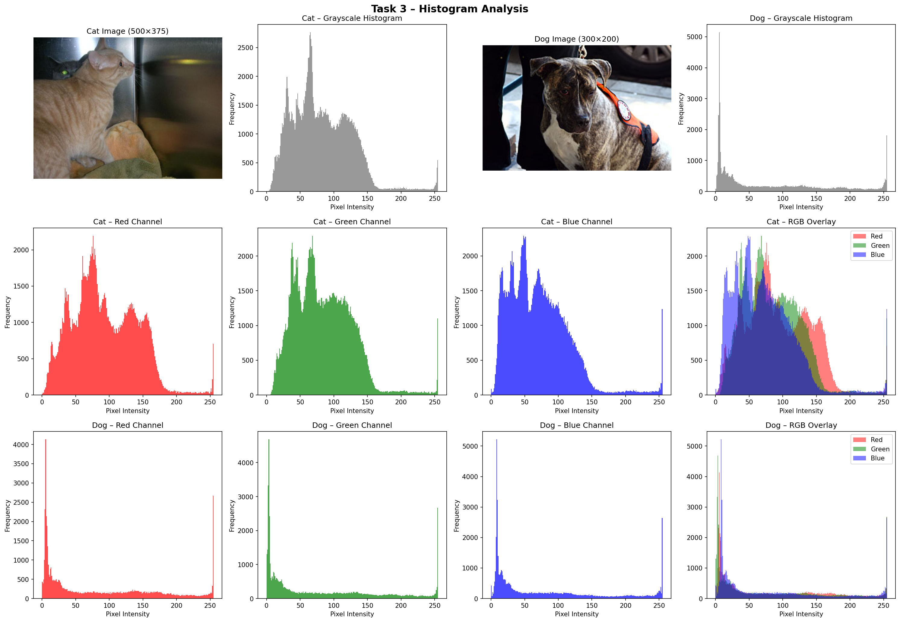

# 🐱🐶 Cat vs Dog Classification

**Image Processing Course — Phase 01**

---

## 📌 Overview

This project focuses on binary image classification to distinguish between **cats and dogs** using deep learning techniques.

In Phase 01, the work focuses on:

* Understanding the dataset
* Analyzing image properties
* Exploring brightness and contrast effects

Future phases will include building CNN and Transfer Learning models.

---

## 📂 Project Structure

```
image_processing_project/
│
├── data/
│   ├── raw/            # Original dataset (not uploaded)
│   └── subset/         # 6,000 selected images (3k cats / 3k dogs)
│
├── notebooks/
│   └── analysis.ipynb  # Phase 01 analysis
│
├── src/
│   └── subset.py       # Script to create dataset subset
│
├── models/             # Saved models (Phase 02+)
├── results/            # Output images & graphs
│
├── requirements.txt
└── README.md
```

---

## 📊 Dataset

* **Name:** Dogs vs Cats
* **Source:** Source: https://www.kaggle.com/datasets/karakaggle/kaggle-cat-vs-dog-dataset
* **Original Size:** 25,000 images
* **Subset Used:** 6,000 images (balanced)

💡 A smaller subset was used to reduce training time while keeping good diversity.
⚠️ Dataset is not included in this repository due to size limits.
Download it manually from Kaggle and place it inside data/raw/

---

## ✅ Phase 01 — Completed Tasks

### 1. Dataset Exploration

* Displayed sample images
* Counted number of images per class

📌 Output: `task1_sample_images.png`

---

### 2. Data Understanding

* Analyzed:

  * Image type (RGB)
  * Bit depth (8-bit)
  * Resolution distribution

📌 Output: `task2_resolution_distribution.png`

---

### 3. Histogram Analysis

* Generated:

  * Grayscale histogram
  * RGB channel histograms
* Calculated brightness & contrast

📌 Output: `task3_histogram_analysis.png`

---

### 4. Brightness & Contrast Adjustment

* Applied:

  * Brightness increase/decrease
  * Contrast increase/decrease
* Compared histograms before & after

📌 Outputs:

* `task4_brightness_contrast.png`
* `task4_histograms_comparison.png`

---

## 🔍 Key Insights

* Images are **RGB, 8-bit**, avg size ≈ **300×300 px**
* Pixel values mostly in **mid-range (100–180)**
* Dataset has **lighting variation**
* Preprocessing (normalization) is important for modeling

---

## ⚙️ How to Run

### 1. Install dependencies

```bash
pip install -r requirements.txt
```

### 2. Download dataset

Download from Kaggle and extract into:

```
data/raw/
```

### 3. Create subset

```bash
python src/subset.py
```

### 4. Run analysis

Open:

```
notebooks/analysis.ipynb
```

---

## 🚀 Next Phases

* Image preprocessing (resize, normalize, augment)
* CNN model from scratch
* Transfer Learning (MobileNetV2)
* Model evaluation (accuracy, confusion matrix, ROC)

---

## 🛠️ Tech Stack

* Python
* TensorFlow / Keras
* NumPy
* Matplotlib
* Pillow (PIL)
* Jupyter Notebook

---

## 📌 Deliverables

* ✅ Subset creation script
* ✅ Analysis notebook
* ✅ Results (plots & visualizations)
* ✅ Technical report
* ⏳ Presentation slides

---
## Sample Results




